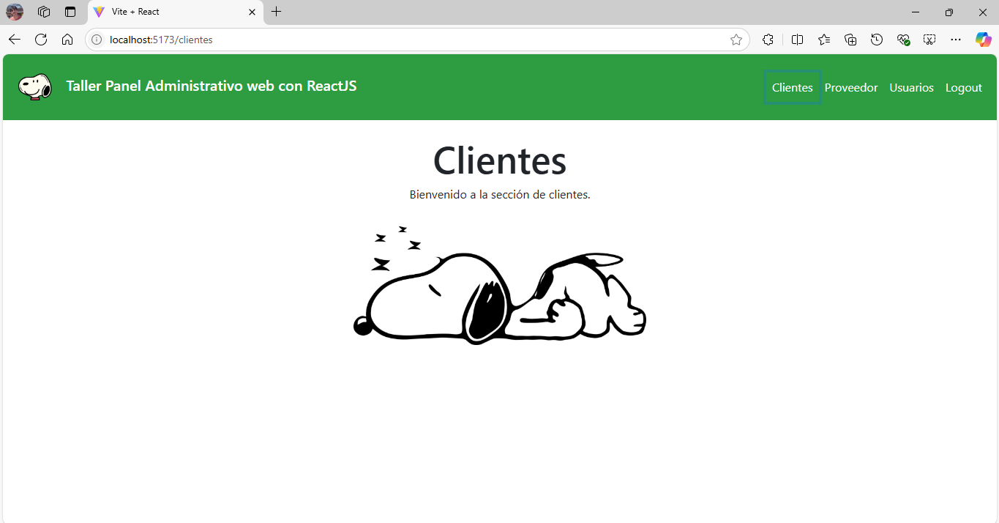
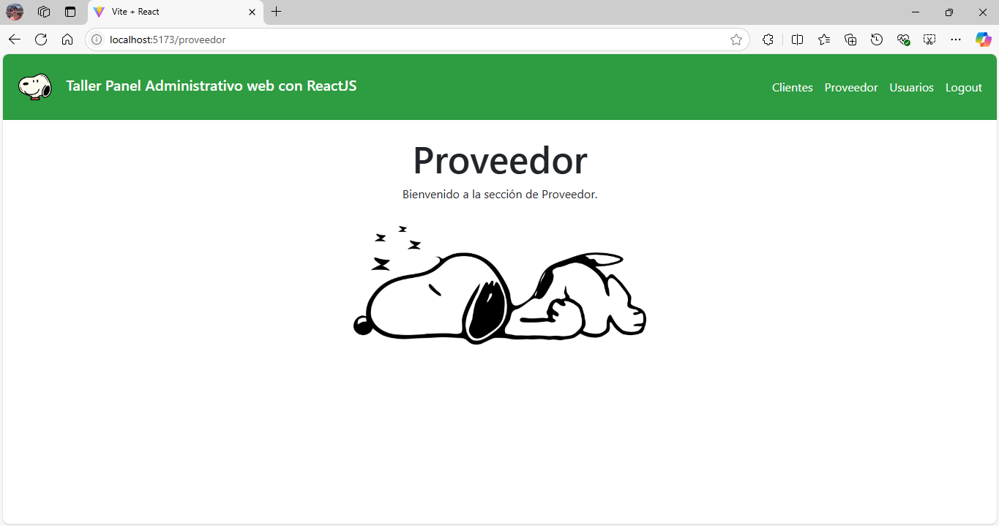
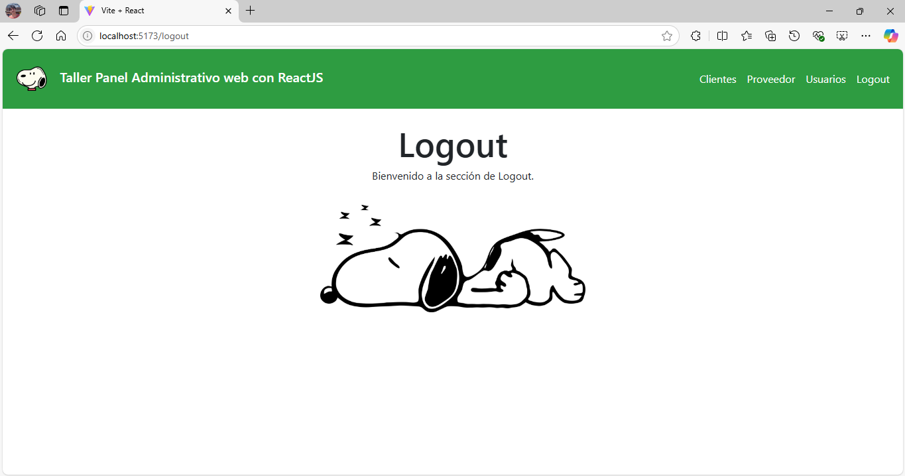

# Proyecto: Panel Administrativo con React y Vite

En este ejercicio práctico, se ha construido un sitio web usando React con Vite que simula un panel administrativo con navegación moderna. Las características del panel incluyen:

## Características:

- **Barra de navegación**: 
  - Un logo.
  - Enlaces a las secciones de:
    - **Clientes**
    - **Proveedor**
    - **Usuarios**
    - **Logout**

## Tecnologías utilizadas:

- **React**: Para la construcción del frontend.
- **Vite**: Como herramienta de construcción y desarrollo.
- **Bootstrap**: Para el diseño y los componentes visuales.
## Pantallazo

A continuación se muestra un pantallazo del panel administrativo:

  
  

  
  

